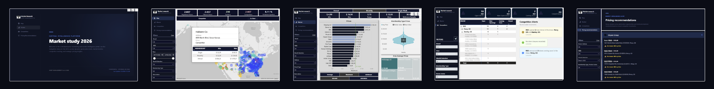
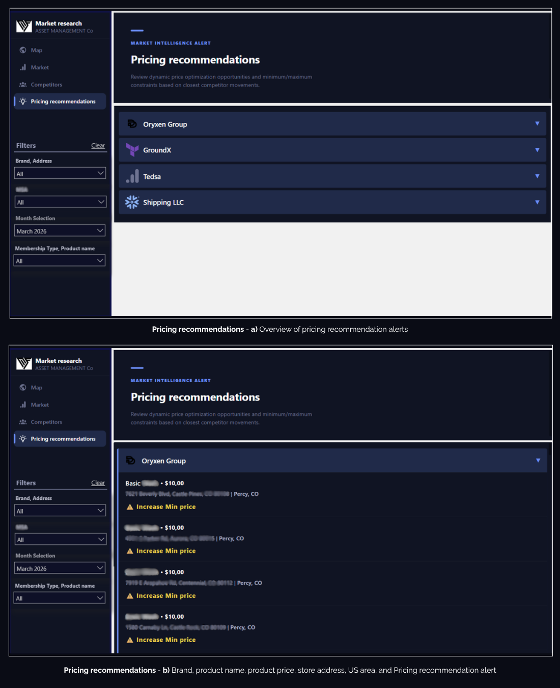

# 📄 Asset Management (US)
### Data Analysis - Capital risk analysis, investment strategies, and data-driven decision making

<p align="left">


</p>

**Power BI • CSV • Excel • Snowflake • HTML visuals**

#### 📌 Executive Summary

- Conducted a 2026 US market study for a confidential investment advisory firm
- Analyzed office distribution, membership structures, pricing models, clients, and competitors
- Built KPI-driven Power BI dashboards using Snowflake data and Power Query ETL workflows
- Delivered interactive business intelligence solutions to identify trends and strategic insights

**Some data was modified for reasons of corporate confidentiality.**

## 🗃️ Relational model and BI report

### 🗄️ Data Model

<details>
<summary><b> 📑 Table details </b></summary>

<br>

- `database`

| Column | Data Type | Description |
|:---|:---|:---|
| `ID` | Integer | Unique identifier |
| `BRAND` | Text | Brand name |
| `ADDRESS` | Text | Brand address |
| `PRODUCT_NAME` | Text | Product name |
| `PRICE` | Currency | Specific service price |
| `SCRAPED_AT` | Date | Registration date |
| `TYPE` | Text | Service type: single, monthly or annual |
| `BRAND_TYPE` | Text | Client or competitor |
| `LATITUDE` | Decimal number | Store latitude |
| `LONGITUDE` | Decimal number | Store longitude |
| `CITY` | Text | US city |
| `STATE` | Text | US state |
| `AREA` | Text | US area |
| `IS_MIN_PRICE` | Whole number | Store minimum price |
| `IS_MAX_PRICE` | Whole number | Store maximum price |
| `CLOSEST_5_COMPETITOR_AVG_PRICE` | Currency | Average price of the closest five competitors |
| `CLOSEST_5_COMPETITOR_MIN_PRICE` | Currency | Minimum price of the closest five competitors |
| `CLOSEST_5_COMPETITOR_MAX_PRICE` | Currency | Maximum price of the closest five competitors |
| `MSA_PRICE_RANK` | Whole number | Price ranking |
| `MSA_PRICE_COUNT` | Whole number | Price count |

</details>

---

- `Relational model pbix after ETL and DAX measures`
  
<p align="center">
  
</p>

## 💻 Power BI report

📄 **[View full Power BI (PDF)](https://github.com/PriscilagsData/AssetManagement_DataAnalysisProject/blob/main/AssetManagement_pbix.pdf)**

<p align="center">
  
</p>

#### 📊 `Cover`

- Interactive cover page for **business presentation**

<p align="center">
  
</p>


#### 📊 `Map`

- **Geographic distribution of stores**, categorized by brand (logos)
- Specific filtering is available by client or competitor
- A tooltip is added with store characteristics and a summary of **key pricing metrics by membership type**
- Filtering by area, brand, or membership allows for the **identification of trends and distribution**
  
<p align="center">
  
</p>

#### 📊 `Market`

- **Price analysis** based on membership type (individual, monthly, annual)
- The analysis includes **maximum, minimum, and average prices** for each store (address) or brand, identifying the mean price to **determine which one falls above or below that average**
- A **box plot** is also included to study the **distribution of prices** by membership, allowing filtering by area, brand, or address to **identify associated changes**
- Furthermore, the **treemap** displays the **Top N areas with the highest prices**
  
<p align="center">
  
</p>

#### 📊 `Competitors`

- Monthly updates on competitor **store status**
- Stores are categorized as **"Open", "Closed", "Coming Soon", and "New Opening"**
- For each brand, details are provided on the number of stores according to their classification and the addresses associated with those stores
- This is a dedicated page for analyzing **competitor market trends, excluding customer movements**

  
<p align="center">
  
</p>

#### 📊 `Pricing recommendation`

- This page alerts our customers about **recommended price adjustments based on data showing the maximum and minimum prices of the five closest competitors to each store**
- It's a month-by-month analysis that specifies, for each brand, **which product and in which direction a price increase is recommended relative to competitors**

<p align="center">
  
</p>

### 🗃️ DAX Measures

<details>
<summary><b> ⚡ Main DAX Measures </b></summary>
<br>

- **Competitors page - Notification-style HTML Content visualization**

```DAX
NotificationHTML = 
-- 1. Opening Logic (yellow)
VAR OpeningTable = CALCULATETABLE(VALUES('database'[BRAND]), 'database'[STORE_STATUS] = "New Opening")
VAR TotalBrandsApe = COUNTROWS(OpeningTable)
VAR ListBrandsApe = 
    IF(TotalBrandsApe > 1,
        "<span style='font-weight: 700; color: #000;'>" & CONCATENATEX(TOPN(TotalBrandsApe - 1, OpeningTable, 'database'[BRAND], ASC), 'database'[BRAND], ", ") & "</span> and <span style='font-weight: 700; color: #000;'>" & MAXX(TOPN(1, OpeningTable, 'database'[BRAND], DESC), 'database'[BRAND]) & "</span>",
        "<span style='font-weight: 700; color: #000;'>" & CONCATENATEX(OpeningTable, 'database'[BRAND]) & "</span>"
    )

VAR TableMSAApe = CALCULATETABLE(VALUES('database'[AREA]), 'database'[STORE_STATUS] = "New Opening")
VAR TotalMSAApe = COUNTROWS(TableMSAApe)
VAR ListMSAApe = 
    IF(TotalMSAApe > 1,
        "<span style='font-weight: 700; color: #000;'>" & CONCATENATEX(TOPN(TotalMSAApe - 1, TableMSAApe, 'database'[AREA], ASC), 'database'[AREA], ", ") & "</span> and <span style='font-weight: 700; color: #000;'>" & MAXX(TOPN(1, TableMSAApe, 'database'[AREA], DESC), 'database'[AREA]) & "</span>",
        "<span style='font-weight: 700; color: #000;'>" & CONCATENATEX(TableMSAApe, 'database'[AREA]) & "</span>"
    )

VAR TextApe = 
    IF([Status New Openings] = 0 || ISBLANK([Status New Openings]),
        "No new store openings detected.",
        ListBrandsApe & " opened <span style='font-weight: 700; color: #000;'>" & [Status New Openings] & "</span> new stores in the Areas: " & ListMSAApe & "."
    )

-- 2. Logic closes (green)
VAR TableCloses = CALCULATETABLE(VALUES('database'[BRAND]), 'database'[STORE_STATUS] = "Closed")
VAR TotalBrandsCie = COUNTROWS(TableCloses)
VAR ListBrandsCie = 
    IF(TotalBrandsCie > 1,
        "<span style='font-weight: 700; color: #000;'>" & CONCATENATEX(TOPN(TotalBrandsCie - 1, TableCloses, 'database'[BRAND], ASC), 'database'[BRAND], ", ") & "</span> and <span style='font-weight: 700; color: #000;'>" & MAXX(TOPN(1, TableCloses, 'database'[BRAND], DESC), 'database'[BRAND]) & "</span>",
        "<span style='font-weight: 700; color: #000;'>" & CONCATENATEX(TableCloses, 'database'[BRAND]) & "</span>"
    )

VAR TableMSACie = CALCULATETABLE(VALUES('database'[AREA]), 'database'[STORE_STATUS] = "Closed")
VAR TotalMSACie = COUNTROWS(TableMSACie)
VAR ListMSACie = 
    IF(TotalMSACie > 1,
        "<span style='font-weight: 700; color: #000;'>" & CONCATENATEX(TOPN(TotalMSACie - 1, TableMSACie, 'database'[AREA], ASC), 'database'[AREA], ", ") & "</span> and <span style='font-weight: 700; color: #000;'>" & MAXX(TOPN(1, TableMSACie, 'database'[AREA], DESC), 'database'[AREA]) & "</span>",
        "<span style='font-weight: 700; color: #000;'>" & CONCATENATEX(TableMSACie, 'database'[AREA]) & "</span>"
    )

VAR TextCloses = 
    IF([Status Closed] = 0 || ISBLANK([Status Closed]),
        "No store closures recorded.",
        ListBrandsCie & " closed <span style='font-weight: 700; color: #000;'>" & [Status Closed] & "</span> stores in the Areas: " & ListMSACie & "."
    )

-- 3. Logic Coming soon (sky blue)
VAR TableComing = CALCULATETABLE(VALUES('database'[BRAND]), 'database'[STORE_STATUS] = "Coming Soon")
VAR TotalBrandsCom = COUNTROWS(TableComing)
VAR ListBrandsCom = 
    IF(TotalBrandsCom > 1,
        "<span style='font-weight: 700; color: #000;'>" & CONCATENATEX(TOPN(TotalBrandsCom - 1, TableComing, 'database'[BRAND], ASC), 'database'[BRAND], ", ") & "</span> and <span style='font-weight: 700; color: #000;'>" & MAXX(TOPN(1, TableComing, 'database'[BRAND], DESC), 'database'[BRAND]) & "</span>",
        "<span style='font-weight: 700; color: #000;'>" & CONCATENATEX(TableComing, 'database'[BRAND]) & "</span>"
    )

VAR TableMSACom = CALCULATETABLE(VALUES('database'[AREA]), 'database'[STORE_STATUS] = "Coming Soon")
VAR TotalMSACom = COUNTROWS(TableMSACom)
VAR ListMSACom = 
    IF(TotalMSACom > 1,
        "<span style='font-weight: 700; color: #000;'>" & CONCATENATEX(TOPN(TotalMSACom - 1, TableMSACom, 'database'[AREA], ASC), 'database'[AREA], ", ") & "</span> and <span style='font-weight: 700; color: #000;'>" & MAXX(TOPN(1, TableMSACom, 'database'[AREA], DESC), 'database'[AREA]) & "</span>",
        "<span style='font-weight: 700; color: #000;'>" & CONCATENATEX(TableMSACom, 'database'[AREA]) & "</span>"
    )

VAR TextComingSoon = 
    IF([Status Coming Soon] = 0 || ISBLANK([Status Coming Soon]),
        "No new stores announced as coming soon.",
        ListBrandsCom & " announced <span style='font-weight: 700; color: #000;'>" & [Status Coming Soon] & "</span> stores coming soon in the Areas: " & ListMSACom & "."
    )

-- 4. Date and Styles 
VAR SelectedDate = SELECTEDVALUE('database'[SCRAPED_AT])
VAR TextDate = IF(NOT ISBLANK(SelectedDate), FORMAT(SelectedDate, "MMMM yyyy", "en-US"), FORMAT(MAX('database'[SCRAPED_AT]), "MMMM yyyy", "en-US"))
VAR CardStyleYellow = "display: flex; align-items: center; background-color: #FFFBE6; border: 1px solid #FFE58F; border-radius: 10px; padding: 15px 20px; width: fit-content; box-shadow: 0px 1px 3px rgba(0,0,0,0.05); margin-bottom: 15px;"
VAR CardStyleGreen = "display: flex; align-items: center; background-color: #F6FFED; border: 1px solid #B7EB8F; border-radius: 10px; padding: 15px 20px; width: fit-content; box-shadow: 0px 1px 3px rgba(0,0,0,0.05); margin-bottom: 15px;"
VAR CardStyleBlue = "display: flex; align-items: center; background-color: #E6F7FF; border: 1px solid #91D5FF; border-radius: 10px; padding: 15px 20px; width: fit-content; box-shadow: 0px 1px 3px rgba(0,0,0,0.05); margin-bottom: 15px;"

RETURN
"<div style='background-color: transparent; text-align: left; padding: 5px; font-family: Segoe UI, sans-serif;'>
    <div style='font-size: 20px; font-weight: 700; color: #000; margin: 0;'>Competition Alerts</div>
    <div style='font-size: 14px; color: #70757a; margin-top: 2px; margin-bottom: 15px;'>Recent market movements</div>

    <div style='" & CardStyleYellow & "'>
        <div style='margin-right: 15px;'></div>
        <div>
            <div style='font-size: 16px; color: #3c4043; line-height: 1.4;'>" & TextApe & "</div>
            <div style='font-size: 12px; color: #9aa0a6; margin-top: 5px; text-transform: capitalize;'>" & TextDate & "</div>
        </div>
    </div>

    <div style='" & CardStyleGreen & "'>
        <div style='margin-right: 15px;'></div>
        <div>
            <div style='font-size: 16px; color: #3c4043; line-height: 1.4;'>" & TextCloses & "</div>
            <div style='font-size: 12px; color: #9aa0a6; margin-top: 5px; text-transform: capitalize;'>" & TextDate & "</div>
        </div>
    </div>

    <div style='" & CardStyleBlue & "'>
        <div style='margin-right: 15px;'></div>
        <div>
            <div style='font-size: 16px; color: #3c4043; line-height: 1.4;'>" & TextComingSoon & "</div>
            <div style='font-size: 12px; color: #9aa0a6; margin-top: 5px; text-transform: capitalize;'>" & TextDate & "</div>
        </div>
    </div>
</div>"
```

- **Pricing recommendation page - Interactive HTML Content visualization**

```DAX
Pricing_Recommendations_HTML = 
VAR BgDark = "#0d1424"
VAR Surface = "rgba(79, 142, 255, 0.18)"
VAR TextMain = "#ffffff"
VAR TextMuted = "#a0a7c1"
VAR Border = "1px solid rgba(255,255,255,0.07)"

-- 1. We filtered the table, leaving ONLY the rows that have a valid recommendation
VAR TableWithRecommendations = 
    FILTER(
        'database',
        'database'[BRAND_TYPE] = "Co Client" && 
        NOT('database'[STORE_STATUS] IN {"Closed", "Coming Soon"}) &&
        (
            -- Condition of mutual exclusion
            ('database'[IS_MIN_PRICE] = 1 && 'database'[PRICE] < 'database'[CLOSEST_5_COMPETITOR_MIN_PRICE]) <>
            ('database'[IS_MAX_PRICE] = 1 && 'database'[PRICE] < 'database'[CLOSEST_5_COMPETITOR_MAX_PRICE])
        )
    )

-- 2. Iteration on the valid brands
VAR CardsList = 
    CONCATENATEX(
        VALUES('database'[BRAND]),
        VAR CurrentBrand = 'database'[BRAND]
        VAR BrandRows = FILTER(TableWithRecommendations, 'database'[BRAND] = CurrentBrand)
        
        -- Dynamic dictionary to retrieve the current brand URL in the iteration
        VAR BrandLogoURL = 
            SWITCH(
                TRIM(CurrentBrand),
                "Halvern Co", "https://cdn.simpleicons.org/algolia/003DFF",
                "Zenvor Inc", "https://cdn.simpleicons.org/airtable/18BFFF",
                "Arclen Group", "https://cdn.simpleicons.org/figma/F24E1E",
                "Oryxen Group", "https://www.logosymbol.com/zb_users/upload/2026/03/logo-for-the-letter-dd.png",
                "ShipF LLC", "https://www.logosymbol.com/zb_users/upload/2026/03/minimal-and-elegant-e-logo-design.png",
                "B&C", "https://cdn.prod.website-files.com/6268563cdf1c400e906204a3/644820734be209b3410535b0_francis%20and%20sons.png",
                "Hale SDD", "https://cdn.simpleicons.org/cloudflare/F38020",
                "Moedo", "https://www.logosymbol.com/zb_users/upload/2026/04/3d-t-cube-logo.png",
                "Tedsa", "https://cdn.simpleicons.org/googleanalytics/6B7394",
                "RSD", "https://cdn.simpleicons.org/sentry/362D59",
                "Larkspur", "https://cdn.simpleicons.org/firebase/FFCA28",
                "Norwyn Holdings", "https://cdn.simpleicons.org/digitalocean/0080FF",
                "Talvix", "https://cdn.simpleicons.org/supabase/3ECF8E",
                "Klyden Corp", "https://cdn.simpleicons.org/netlify/00C7B7",
                "GroundX", "https://cdn.simpleicons.org/terraform/7B42BC",
                "Rhode Co", "https://cdn.simpleicons.org/docker/2496ED",
                "Zid LLC", "https://cdn.simpleicons.org/retool/3D3D3D",
                "Shipping LLC", "https://cdn.simpleicons.org/snowflake/73B3FA",
                ""
            )
        
        -- 35px logos
        VAR LogoTag = IF(BrandLogoURL <> "", "", "")

        -- We built the internal product lines for this brand
        VAR RowsHTML = 
            CONCATENATEX(
                BrandRows,
                VAR NeedsMin = 'database'[IS_MIN_PRICE] = 1 && 'database'[PRICE] < 'database'[CLOSEST_5_COMPETITOR_MIN_PRICE]
                
                VAR Label = IF(NeedsMin, "Increase Min price", "Increase Max price")
                VAR Icon = "⚠️ "
                VAR LabelColor = IF(NeedsMin, "#ffd200", "#ff9f43")
                
                -- Currency format
                VAR CurrentPrice = FORMAT('database'[PRICE], "$#,##0.00")
                
                RETURN
                    "<div style='padding: 14px 18px; border-top: " & Border & ";'>" &
                        -- Product Name + Price row with inline faded style
                        "<div style='font-size: 16px; font-weight: 600; color: " & TextMain & "; display: flex; align-items: center; gap: 6px;'>" & 
                            "<span>" & 'database'[PRODUCT_NAME] & "</span>" & 
                            "<span style='font-size: 15px; font-weight: 700; color: white " & TextMuted & ";'> • " & CurrentPrice & "</span>" & 
                        "</div>" &
                        
                        -- Address and Area
                        "<div style='font-size: 14px; color: " & TextMuted & "; margin-top: 4px;'>" & 'database'[ADDRESS] & " | <strong style='color: #a0a7c1 " & TextMain & ";'>" & 'database'[AREA] & "</strong></div>" &
                        
                        -- Recommendation
                        "<div style='margin-top: 8px; font-size: 16px; font-weight: 700; color: " & LabelColor & "; letter-spacing: 0.5px; display: flex; align-items: center;'>" & 
                            "<span>" & Icon & " " & Label & "</span>" & 
                        "</div>" &
                    "</div>",
                ""
            )
            
        -- Card design
        VAR Card = 
            "<details style='background: " & Surface & "; margin-bottom: 6px; border-radius: 4px; position: relative; font-family: system-ui, -apple-system, sans-serif; overflow: hidden;'>" &
                "<div style='position: absolute; left: 0; top: 0; bottom: 0; width: 3px; background: #4f8eff;'></div>" &
                
                "<summary style='padding: 12px 16px; cursor: pointer; font-weight: 600; font-size: 17px; color: " & TextMain & "; display: flex; align-items: center; justify-content: space-between;'>" & 
                    "<div style='display: flex; align-items: center; gap: 10px; min-width: 0;'>" &
                        LogoTag & 
                        "<span style='white-space: nowrap; overflow: hidden; text-overflow: ellipsis;'>" & CurrentBrand & "</span>" & 
                    "</div>" &
                    "<span style='color: #4f8eff; font-size: 14px; padding-left: 10px;'>▼</span>" & 
                "</summary>" &
                "<div style='background: " & BgDark & "; padding-bottom: 4px; margin-left: 3px;'>" & RowsHTML & "</div>" &
            "</details>"
        
        RETURN IF(COUNTROWS(BrandRows) > 0, Card, ""),
        ""
    )

-- 3. Final render
RETURN
    "<div style='background-color: " & BgDark & "; padding: 15px 12px; border-radius: 1px; font-family: system-ui, -apple-system, sans-serif; height: 100%; overflow-y: auto; box-sizing: border-box;'>" &
        CardsList &
    "</div>"
```
</details>

## 📨 Contact and info

* You are welcome to:

**Request services**, compose a friendly **e-mail**, **send requests about ETL** and **suggestions** to: <sidolipriscilag@gmail.com>
  
Priscila Gutierrez Sídoli - Linkdn  <a href="https://www.linkedin.com/in/priscilagsidoliiq/" target="_blank">
  
  </a>

> **If you found this project interesting, please consider giving the repository a ⭐ to support the work.**
