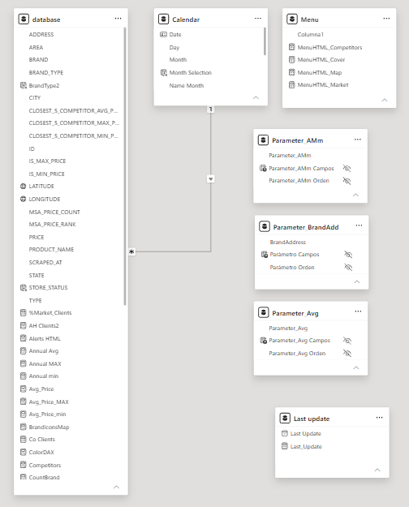
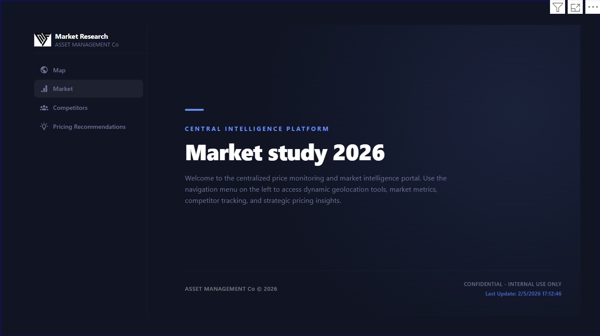
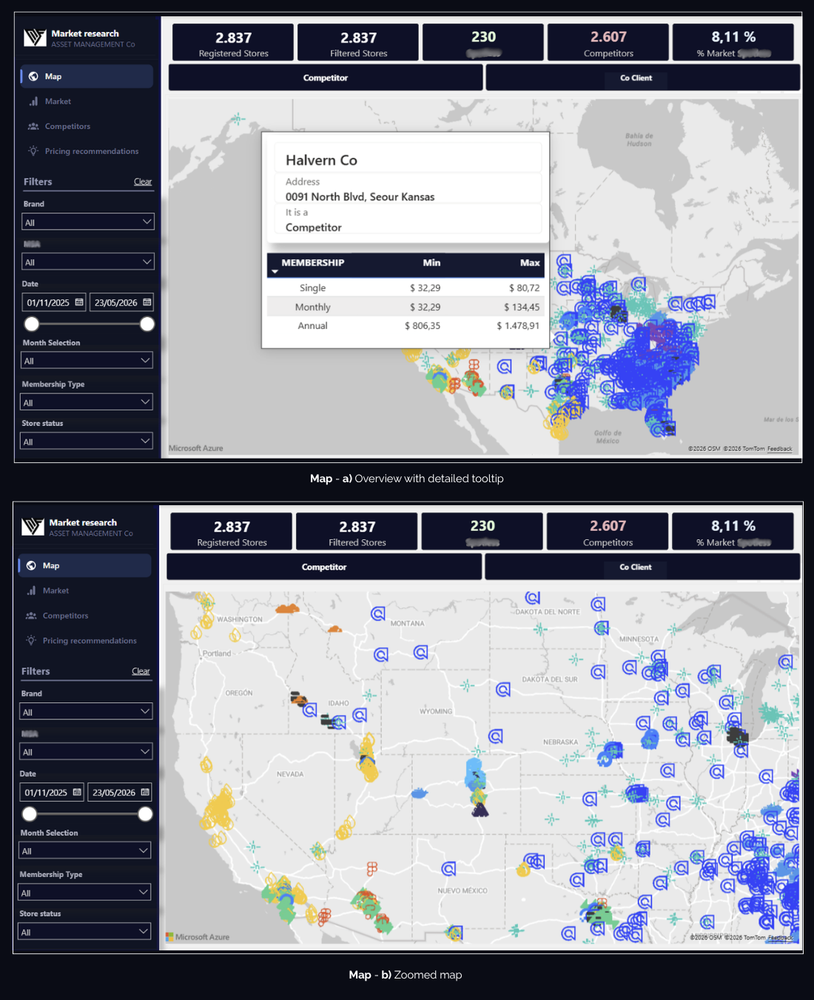
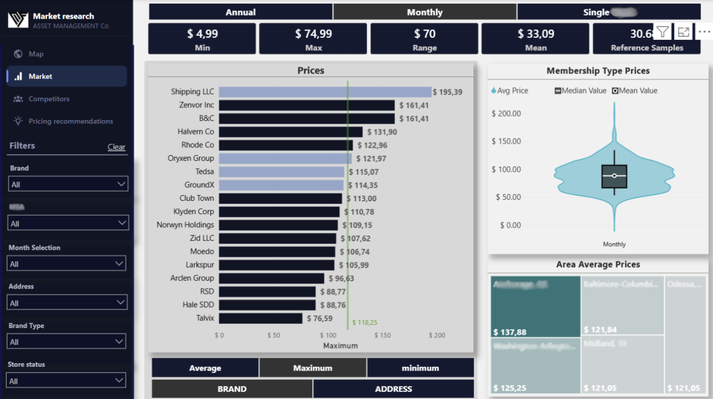
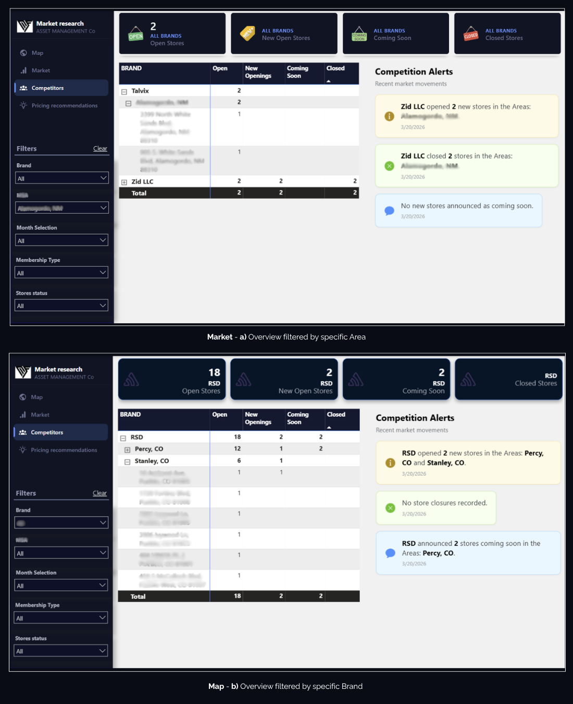

# 📄 Asset Management (US)
### Data Analysis - Capital risk analysis, investment strategies, and data-driven decision making

<p align="left">


</p>

**Power BI • CSV • Excel • Snowflake • HTML visuals**

#### 📌 Executive Summary

- Conducted a 2026 US market study for a confidential investment advisory firm
- Analyzed office distribution, membership structures, pricing models, clients, and competitors
- Built KPI-driven Power BI dashboards using Snowflake data and Power Query ETL workflows
- Delivered interactive business intelligence solutions to identify trends and strategic insights

**Some data was modified for reasons of corporate confidentiality.**

## 🗃️ Relational model and BI report

### 🗄️ Data Model

<details>
<summary><b> 📑 Table details </b></summary>

<br>

- `database`

| Column | Data Type | Description |
|:---|:---|:---|
| `ID` | Integer | Unique identifier |
| `BRAND` | Text | Brand name |
| `ADDRESS` | Text | Brand address |
| `PRODUCT_NAME` | Text | Product name |
| `PRICE` | Currency | Specific service price |
| `SCRAPED_AT` | Date | Registration date |
| `TYPE` | Text | Service type: single, monthly or annual |
| `BRAND_TYPE` | Text | Client or competitor |
| `LATITUDE` | Decimal number | Store latitude |
| `LONGITUDE` | Decimal number | Store longitude |
| `CITY` | Text | US city |
| `STATE` | Text | US state |
| `AREA` | Text | US area |
| `IS_MIN_PRICE` | Whole number | Store minimum price |
| `IS_MAX_PRICE` | Whole number | Store maximum price |
| `CLOSEST_5_COMPETITOR_AVG_PRICE` | Currency | Average price of the closest five competitors |
| `CLOSEST_5_COMPETITOR_MIN_PRICE` | Currency | Minimum price of the closest five competitors |
| `CLOSEST_5_COMPETITOR_MAX_PRICE` | Currency | Maximum price of the closest five competitors |
| `MSA_PRICE_RANK` | Whole number | Price ranking |
| `MSA_PRICE_COUNT` | Whole number | Price count |

</details>

---

- `Relational model pbix after ETL and DAX measures`
  
<p align="center">
  
</p>

## 💻 Power BI report

📄 **[View full Power BI (PDF)](  )**

<p align="center">
  
</p>

#### 📊 `Cover`

<p align="center">
  
</p>

Its purpose is to...............

#### 📊 `Map`

<p align="center">
  
</p>

This section analyzes...........

#### 📊 `Market`

<p align="center">
  
</p>

This section analyzes...........

#### 📊 `Competitors`

<p align="center">
  
</p>

This section analyzes...........

#### 📊 `Pricing recommendation`

<p align="center">
  
</p>

This section analyzes...........

### 🗃️ DAX Measures

<details>
<summary><b> ⚡ Main DAX Measures </b></summary>
<br>

- **Interactive HTML Content visualization............**

```DAX
kjbvx
```

- **Interactive HTML Content visualization..........**

```DAX
jhguf
```
</details>

## 📨 Contact and info

* You are welcome to:

**Request services**, compose a friendly **e-mail**, **send requests about ETL** and **suggestions** to: <sidolipriscilag@gmail.com>
  
Priscila Gutierrez Sídoli - Linkdn  <a href="https://www.linkedin.com/in/priscilagsidoliiq/" target="_blank">
  
  </a>

> **If you found this project interesting, please consider giving the repository a ⭐ to support the work.**
